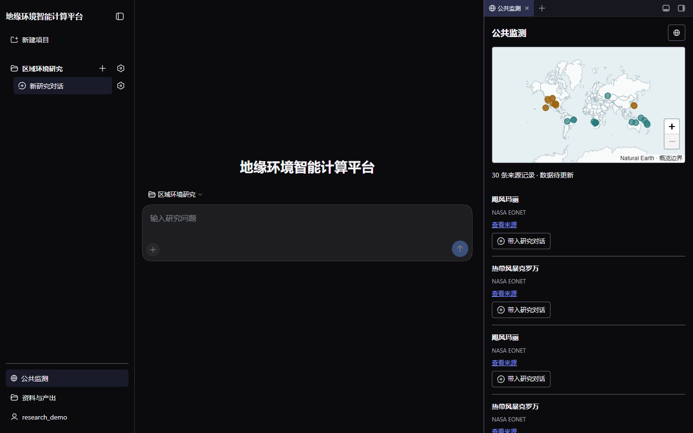

<div align="center">

# GeoSentinel

**地缘环境智能计算平台**

基于 DeepSeek Harness 的多用户研究工作台，让研究问题、智能体协作和空间证据在同一项目中持续积累。


[开始部署](dsh/README.md) · [旧版迁移](docs/migration-to-dsh.md) · [公共监测](dsh/MONITOR.md) · [实现与验收](dsh/IMPLEMENTATION.md) · [文档索引](docs/README.md)

</div>



*实际登录后的原生界面。截图使用独立展示账号和空研究项目；右侧为公共监测记录，不代表已完成的研究结论。*

## 一个研究工作台

GeoSentinel 面向区域环境与国际地缘研究，将对话、数据获取、分析任务和证据资料组织在多个独立研究项目中。它源自 NTL-GPT，但不要求每项研究都使用夜间灯光数据。

当前推荐入口是 **`dsh/`**：复用 DSH 原生聊天、用户问答、方案审阅和 Todo 交互，结合 Better Sidebar 与受控多智能体调度。仓库仍保留旧 Python 运行时，用于能力迁移和回退参考；它不是新版的另一套公开界面。

> 当前是受控试点，不是已经完成全部 NTL 能力迁移的通用平台。数据和模型回答需要核对来源、适用范围与不确定性；公共监测线索不是自动确认的事实。

## 已实现

| 能力 | 当前实现 |
| --- | --- |
| 多用户研究 | 邀请注册、账号管理、多个项目与对话、项目级输入和对话级产出 |
| 原生交互 | 流式聊天、提问和自由回答、方案审阅、原生 Todo 状态投影 |
| 四角色协作 | 地缘分析师统筹，数据助手、分析助手和事件助手按需参与 |
| 可控执行 | 按版本确认方案、角色工具白名单、取消与并发限制 |
| 地理计算 | 固定 GEE 获取入口、栅格检查、受限 Python 执行、证据和报告生成 |
| 公共监测 | 独立采集、共享本地快照、全球地图、事件队列、来源链接和私有证据导入 |
| 统一工作区 | Better Sidebar 监测与资料标签，Dream Skin 深色主题，桌面优先 |

### 三个插件，一套任务状态

| 插件 | 职责 | 边界 |
| --- | --- | --- |
| `dsh-workbench` | 原生 UI 接入、项目导航、问答展示、监测与资料标签 | 不直接授予执行权限 |
| `dsh-platform` | 账号、项目归属、API、方案版本与请求校验、审计 | 不另建智能体调度循环 |
| `dsh-research` | 数据与证据工具、Docker 作业、固定 GEE 获取 | 不允许模型控制宿主配置 |

研究流程：**提出问题 → 补充必要信息 → 审阅方案 → 按需执行 → 核验和下载产物**。

AgentTeams 是唯一调度器，原生 Todo 从团队任务投影，不让模型维护重复进度。普通提问不会授予执行权限，只有通过平台校验的方案确认才会启动受控团队。

## 快速开始

环境：Node.js 24、pnpm 10.33.0、Docker Desktop/Linux Docker。GEE 需要有效项目和凭据；普通聊天不需要 GEE。

```powershell
git clone https://github.com/guihousun/GeoSentinel.git
Set-Location GeoSentinel
```

按照 [DSH 安装指南](dsh/README.md) 完成四步：

1. 从固定上游版本重建 AgentTeams fork，并应用仓库提供的补丁。
2. 在 `dsh/` 执行 `pnpm install --frozen-lockfile`，配置自己的 `.env`。
3. 构建 GIS Docker 镜像，初始化自己的管理员账号。
4. 运行 `pnpm start --port 8510 --no-open`，打开 `http://127.0.0.1:8510/`。

不要用个人全局 `dsh web` 替代项目启动器，也不要只复制 `dsh/`：新版仍复用仓库内的 `packages/ntl_toolkit` 和 `monitoring/sources.py`。

**从旧项目迁入，请先读 [详细迁移手册](docs/migration-to-dsh.md)。** 旧 PostgreSQL/Streamlit 对话不自动迁移，仓库没有出厂管理员密码或固定邀请码。

## 执行与数据边界

- 账号和项目元数据使用独立 SQLite，对话使用 DSH 会话记录；新版不依赖旧 PostgreSQL。
- 输入与产出按用户和项目隔离。公共监测共享，导入研究后的证据副本属于当前项目。
- 模型生成的 Python 在禁网 Docker 容器中执行；固定 GEE 获取入口单独联网、只读挂载管理员凭据。
- 普通用户不开放宿主终端、任意目录、模型配置、依赖安装或插件市场。
- Docker 不保证对任意恶意代码绝对安全。公网仍需要 HTTPS、限流、备份和运维监控。
- `.env`、认证文件、数据库、用户工作区、测试账号和运行缓存不随仓库发布。

## 迁移中的能力

完整 NTL/Earthdata/MCP 工具覆盖、国家专题、企业知识库、个人 GEE 账号绑定及大规模作业队列仍需逐项迁移和验收。不要把旧 Python 工具清单当作新版已开放能力清单。

| 文档 | 用途 |
| --- | --- |
| [安装和运行](dsh/README.md) | fork 构建、依赖、配置、管理员与服务启动 |
| [旧版迁移与回退](docs/migration-to-dsh.md) | 数据取舍、配置映射、双机迁移、端口切换和验收 |
| [实现与验收](dsh/IMPLEMENTATION.md) | 已验证功能和未完成范围 |
| [第三方复用边界](dsh/DEPENDENCIES.md) | DSH、AgentTeams、Better Sidebar、Dream Skin 的集成方式 |
| [公共监测](dsh/MONITOR.md) | 来源、离线底图、独立运行与限制 |
| [旧 Python 平台](docs/geoenvironmental-platform.md) | 旧运行时参考，不是新版部署入口 |

## 参与与致谢

提交问题时请提供版本、复现步骤及脱敏日志，勿上传密码、令牌和用户资料。参见 [贡献指南](CONTRIBUTING.md) 与 [安全说明](SECURITY.md)。

本项目复用 DeepSeek Harness、[DSH AgentTeams](https://github.com/NanmiCoder/dsh-agent-teams)、Better Sidebar、[Dream Skin](https://github.com/RevolutionLA/dsh-dream-skin)、Leaflet、Natural Earth，以及 NTL-GPT 的确定性地理工具底座。AgentTeams 的上游 MIT 许可与可重建差异保存在 [vendor](dsh/vendor/agentteams-source.json)；第三方组件保留各自许可。
