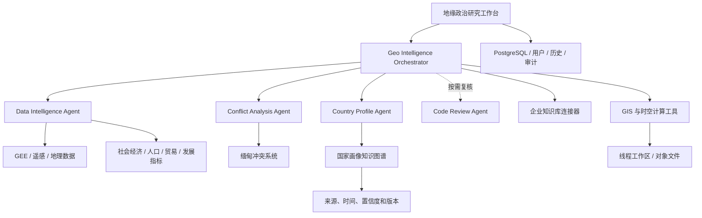

# 地缘环境智能计算平台首期改造规划与报价

> 文档版本：v0.2  
> 编制日期：2026-07-31  
> 基础代码：NTL-GPT `main`，提交 `4c3ba82`  
> 改造分支：`codex/geoenvironmental-intelligence-platform`  
> 人工单价：420 元/人天

## 1. 项目定位

本项目基于 NTL-GPT 现有的多智能体、地理空间计算、Google Earth
Engine、PostgreSQL、知识检索和线程工作区能力，改造为面向人文地理与
地缘政治研究的智能计算平台。

首期目标不是简单替换名称和页面颜色，而是形成可实际使用的地缘政治
研究工作台，支持：

- 地缘事件检索、筛选、定位、时间线和空间影响分析；
- 遥感、社会经济、人口、基础设施和冲突数据的统一检索与计算；
- 企业知识库的检索、引用、权限和更新对接；
- 缅甸冲突现有系统的接入与专题分析；
- 将事件监测和数据获取功能接口接入周边国家地缘环境监测预警平台；
- 国家画像和关系知识图谱的构建、查询与可视化；
- 具备账号、权限、审计、HTTPS、备份和监控的可访问服务。

## 2. 首期范围边界

首期按“可演示、可计算、可扩展、可部署”的 MVP 交付，不承诺一次性
覆盖全球所有国家、所有冲突源和全部公司内部知识。

建议首期边界：

- 国家画像：5–8 个试点国家，以缅甸及周边国家为核心；
- 冲突专题：完整接入一个缅甸冲突系统；
- 数据接口：优先建设 8–12 个稳定、许可明确的数据源；
- 企业知识库：完成一个正式接口和一个测试环境的连接；
- 用户端：以电脑端研究工作台为主，移动端保证基本可用；
- 部署：一个生产环境、一个备份恢复方案，不包含等保测评和第三方渗透测试。

## 3. 现有能力复用评估

| 现有能力 | 复用程度 | 首期处理方式 |
| --- | ---: | --- |
| 账号登录、PostgreSQL 历史、线程隔离、并发和配额 | 80%–90% | 保留数据模型，补充角色权限和审计字段 |
| LangGraph / Deep Agents 编排 | 60%–70% | 保留运行框架，重构地缘政治 Agent 和路由 |
| GEE、Earthdata、`ntl-gis-core`、`ntl-download` | 70%–80% | 作为地理空间计算底座，扩展通用遥感数据 |
| Data Searcher | 50%–60% | 改造为 Data Intelligence Agent，扩展地缘数据源 |
| ConflictNTL | 30%–50% | 复用事件筛选、AOI、遥感影响评估和报告范式 |
| 本地 RAG | 30%–50% | 保留为补充能力，主要接入企业知识库 |
| Streamlit UI | 20%–30% | 保留运行入口，全面重做信息架构和视觉系统 |
| 部署脚本、Nginx、HTTPS、PostgreSQL | 60%–70% | 复用经验，补充健康检查、备份和运维文档 |

## 4. 建议产品架构

建议首期保持少量职责明确的 Agent，不为每个数据源单独建立 Agent：

1. **Geo Intelligence Orchestrator**：任务拆解、方法选择、证据汇总和最终报告。
2. **Data Intelligence Agent**：遥感、社会经济、边界、新闻事件和指标数据检索。
3. **Conflict Analysis Agent**：冲突事件、时间线、空间聚集、影响区和变化评估。
4. **Country Profile Agent**：国家画像、关系图谱、指标快照和证据更新。
5. **Code Review Agent**：仅在用户要求或复杂方法需要独立复核时启动。

企业知识库、知识图谱和数据源应作为工具或服务接入，避免形成过多相互对话的
Agent，降低延迟、费用和错误传播。

## 5. 首期工作分解、工期与报价

| 编号 | 工作包 | 主要内容 | 核心交付物 | 人天 | 金额 |
| --- | --- | --- | --- | ---: | ---: |
| A0 | 现有平台功能迁移及智能体架构改造 | 将此前交付版本同步到当前 NTL-GPT `main` 能力基线；迁移账号、存储、运行安全、MCP、数据下载和前端优化；升级地缘政治多智能体职责、路由和工具调用协议 | 功能迁移清单、升级后的运行底座、地缘政治多智能体架构、回归测试结果 | 14 | 5,880 元 |
| A1 | UI 全面改造 | 地缘态势首页、事件中心、地图分析、国家画像、数据中心、任务工作台、管理入口、视觉系统 | 新版电脑端 UI、基本移动端适配、组件和交互规范 | 20 | 8,400 元 |
| A2 | 企业知识库对接 | 鉴权、检索、引用、文档来源、权限映射和错误降级 | 知识库连接器、引用结果组件、接口测试和配置说明 | 6 | 2,520 元 |
| A3 | 缅甸冲突功能集成 | 现有系统接口适配、数据标准化、事件检索、地图时间线、专题分析、结果回写 | 缅甸冲突专题页、连接器、分析工作流、验收案例 | 15 | 6,300 元 |
| A4 | 地缘数据接口增强 | GEE 数据目录、社会经济、人口、边界、贸易/发展、冲突与人道数据适配；元数据、缓存和来源追踪 | 数据源注册表、8–12 个连接器、统一结果协议和数据目录页面 | 18 | 7,560 元 |
| A5 | 周边国家地缘环境监测预警平台集成 | 将地缘环境智能计算模型的事件监测和数据获取功能接口接入外部预警平台；完成鉴权、字段映射、接口适配、错误处理、联调和验收 | 接口适配层、事件监测与数据获取服务、联调记录、接口说明和验收案例 | 14 | 5,880 元 |
| A6 | 国家画像知识图谱 MVP | 国家/地区/组织/事件/指标等核心实体及关系，来源和时间信息，查询与展示 | 5–8 国试点图谱、查询接口、国家画像页、关系图谱视图 | 7 | 2,940 元 |
| A7 | 可访问服务部署 | 生产配置、HTTPS、反向代理、数据库、文件存储、密钥管理、备份恢复、日志监控 | 可访问生产服务、部署脚本、健康检查、备份和运维手册 | 9 | 3,780 元 |
| A8 | 集成测试与验收 | Agent 路由、接口失败、权限、数据来源、地图和报告回归；用户培训和交付文档 | 验收报告、测试用例、问题清单、管理员和用户手册 | 8 | 3,360 元 |
|  | **合计** |  |  | **111 人天** | **46,620 元** |

上述报价仅包含研发人工。模型 API、企业知识库服务费、第三方数据订阅、云服务器、
对象存储、域名、短信/邮件、商业地图和安全测评费用不包含在人工报价中。

## 6. 日历工期

### 单人顺序开发

- 净研发时间：111 个工作日；
- 按每周 5 个工作日计算：约 23 周；
- 加入接口等待、评审、验收和修复缓冲：建议合同日历期为 24 周，约 6 个月。

### 推荐阶段安排

| 阶段 | 周期 | 时间节点 | 主要里程碑 |
| --- | --- | --- | --- |
| M1 平台迁移与架构升级 | 第 1–3 周 | 2026.08.01–2026.08.21 | 近期功能迁移、地缘政治多智能体架构、回归基线 |
| M2 UI 与知识库 | 第 4–8 周 | 2026.08.22–2026.09.25 | 新 UI 框架、核心页面、企业知识库基本贯通 |
| M3 外部系统与数据 | 第 9–15 周 | 2026.09.26–2026.11.13 | 缅甸系统、首批地缘数据连接器 |
| M4 预警平台接口集成 | 第 16–18 周 | 2026.11.14–2026.12.04 | 事件监测、数据获取接口适配及外部平台联调 |
| M5 国家画像与部署 | 第 19–21 周 | 2026.12.05–2026.12.25 | 试点国家、查询、画像页面和生产环境 |
| M6 集成与上线 | 第 22–24 周 | 2026.12.26–2027.01.15 | 回归、HTTPS、监控、培训和验收 |

以上时间节点按 2026 年 8 月 1 日启动计算。企业知识库、缅甸系统或周边国家
地缘环境监测预警平台接口未按计划
提供，以及需求范围发生变更时，受影响阶段的时间节点相应顺延。

## 7. 建议付款里程碑

| 里程碑 | 验收内容 | 人天 | 金额 |
| --- | --- | ---: | ---: |
| P1 | 现有平台功能迁移和地缘政治多智能体架构完成 | 14 | 5,880 元 |
| P2 | 新版 UI 和企业知识库对接完成 | 26 | 10,920 元 |
| P3 | 缅甸专题和首批地缘数据接口完成 | 33 | 13,860 元 |
| P4 | 事件监测和数据获取功能接口完成外部预警平台联调 | 14 | 5,880 元 |
| P5 | 国家画像知识图谱 MVP 和生产部署完成 | 16 | 6,720 元 |
| P6 | 集成测试、文档、培训和最终验收 | 8 | 3,360 元 |
|  | **合计** | **111** | **46,620 元** |

## 8. 模块验收标准

### 现有平台迁移与智能体架构

- 将此前交付版本缺失的近期稳定功能迁入新平台，并提供功能迁移清单；
- 账号、PostgreSQL 历史、线程工作区、并发配额、MCP、数据下载和运行安全能力可用；
- 完成 Geo Intelligence Orchestrator、Data Intelligence Agent、Conflict Analysis
  Agent 和 Country Profile Agent 的职责、路由及工具边界改造；
- 原有可复用能力通过回归测试，不因产品改名或 UI 改造丢失。

### UI

- 首屏体现地缘态势、重点事件、国家和数据状态，不再以夜间灯光工具为产品中心；
- 具备态势首页、事件中心、地图分析、国家画像、数据中心和任务工作台；
- 在 1920×1080、1366×768 电脑分辨率下无主要内容遮挡；
- 手机端可以登录、查看任务和基本结果，不要求完整制图体验；
- 深色背景下文本、图标、JSON、工具结果和地图控件可读。

### 企业知识库

- 使用正式鉴权方式，不在前端或日志暴露密钥；
- 返回可追踪的文档标题、片段、来源、时间和引用标识；
- 支持权限拒绝、超时、空结果和服务不可用时的明确降级；
- 不使用企业知识库代替数据接口或计算工具。

### 缅甸冲突专题

- 至少完成事件列表、地图、时间线、筛选和专题分析；
- 统一事件 ID、时间、坐标、来源、参与方、事件类型和置信度字段；
- 可以从一个验收案例完成“数据获取—分析—地图—报告”闭环；
- 遥感变化仅作为候选证据，不自动推断伤亡、责任或因果。

### 数据接口

- 每个连接器声明来源、许可、更新时间、空间/时间覆盖和字段含义；
- 统一返回状态、实际文件或表路径、来源元数据和错误信息；
- 同一请求可以复用缓存，避免重复下载大文件；
- 首批建议覆盖 GEE 遥感、World Bank、UN/HDX、GDELT、OSM/geoBoundaries
  等公开数据；ACLED、商业地图等按许可证另行确认。

### 周边国家地缘环境监测预警平台集成

- 事件监测和数据获取接口符合甲方提供的鉴权、字段、调用频率和安全规范；
- 完成双向字段映射、状态码、超时、重试、幂等和异常降级处理；
- 至少通过一个事件监测案例和一个数据获取案例的端到端联调；
- 提供接口说明、部署配置、联调记录和故障排查方法；
- 外部平台未提供的新增业务页面、历史数据治理和平台本体改造不在本工作包内。

### 国家画像知识图谱

- 至少覆盖国家、行政区、组织、事件、冲突、指标、基础设施、数据集和文档实体；
- 每条关系保留来源、有效时间、采集时间、置信度和版本；
- 同名实体具备稳定 ID 和消歧规则；
- 支持按国家生成指标快照、主要事件、区域关系和证据列表；
- 首期完成 5–8 国试点，不以未验证自动关系填充全球图谱。

### 部署

- 使用 HTTPS、账号登录、角色权限和基础限流；
- PostgreSQL、输出文件、日志和密钥分离管理；
- 提供健康检查、错误日志、数据库备份和恢复演练；
- 服务重启后可自动恢复，运维人员可按文档完成更新和回滚。

## 9. 前置依赖与风险

1. **企业知识库**：第 1 周需要提供 API 文档、鉴权方式、测试账号、权限规则和
   样例响应。若只能通过页面人工操作，工期和方案需要重新评估。
2. **缅甸系统**：需要源代码或稳定 API、字段说明、部署方式、数据许可和测试数据。
   首期不包含对封闭系统的逆向工程。
3. **周边国家地缘环境监测预警平台**：需要提供 API 文档、鉴权方式、测试环境、
   网络访问条件、字段规范、调用限制和联调联系人。若需修改该平台本体或补做历史
   数据治理，应另行评估。
4. **知识图谱**：需要确认首批国家、实体范围和权威来源。人工标注和专家审核超过
   试点范围时，应单独计费。
5. **第三方数据**：公开可访问不等于可以自由再分发。商业数据、ACLED、地图瓦片和
   新闻全文需要单独核验许可。
6. **服务器**：可复用现有 Windows Server 进行首期部署；若要求容器集群、高可用、
   等保、跨区容灾或大规模并发，应作为后续工作包。
7. **范围变化**：需求基线和 UI 原型确认后的新增页面、数据源、国家和外部系统，
   按 420 元/人天估算变更工作量。

## 10. 首期不包含

- 全球全量、持续实时更新的国家知识图谱；
- 舆情全网采集、社交媒体账号画像和自动化心理/立场判定；
- 军事行动预测、自动归责或无证据的风险评分；
- 商业数据采购、模型调用费、云资源费和第三方安全测评；
- 原生 Android/iOS 应用；
- 7×24 小时运维值守和长期数据标注团队。

## 11. 后续阶段建议

首期验收后可按实际使用数据决定是否建设：

- 全球冲突和危机事件监测与告警；
- 能源、港口、航运、贸易和供应链网络分析；
- 多源新闻立场与证据交叉验证；
- 国家风险指标体系和时序监测；
- 情景推演与政策分析辅助；
- 多租户、细粒度权限和机构级知识空间；
- 面向教学的案例库、课程实验和可复现实验模板。
